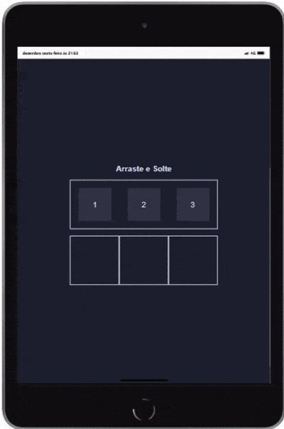

# Arrasta e Solta 🎉

Projetinho com js vanilla 🤩 "Arrasta e Solta"! Este é um projeto divertido e interativo onde você pode arrastar itens numerados para áreas específicas. Quando você coloca os itens nas áreas corretas, a borda dessas áreas muda de cor para mostrar que a ordem está correta.

## Tecnologias Utilizadas 🛠️

Este projeto foi desenvolvido utilizando as seguintes tecnologias:

- **HTML**: Para a estrutura da página.
- **CSS**: Para estilizar os elementos.
- **JavaScript**: Para adicionar a funcionalidade de arrastar e soltar.

## Como Usar 📋

Siga os passos abaixo para começar a usar o projeto:

1. Clone este repositório ou faça o download dos arquivos.
2. Abra o arquivo `index.html` no seu navegador.
3. Arraste os itens numerados da área neutra para as áreas específicas.
4. Quando os itens estiverem na ordem correta (1, 2, 3), a borda das áreas mudará de cor para indicar que você acertou! 🎯

## Funcionalidades ✨

O projeto oferece as seguintes funcionalidades:

- Arrastar e soltar itens.
- Verificação automática da ordem correta dos itens.
- Feedback visual para indicar quando a ordem está correta.

## Demonstração 🎥

Veja o projeto em ação no vídeo abaixo:

